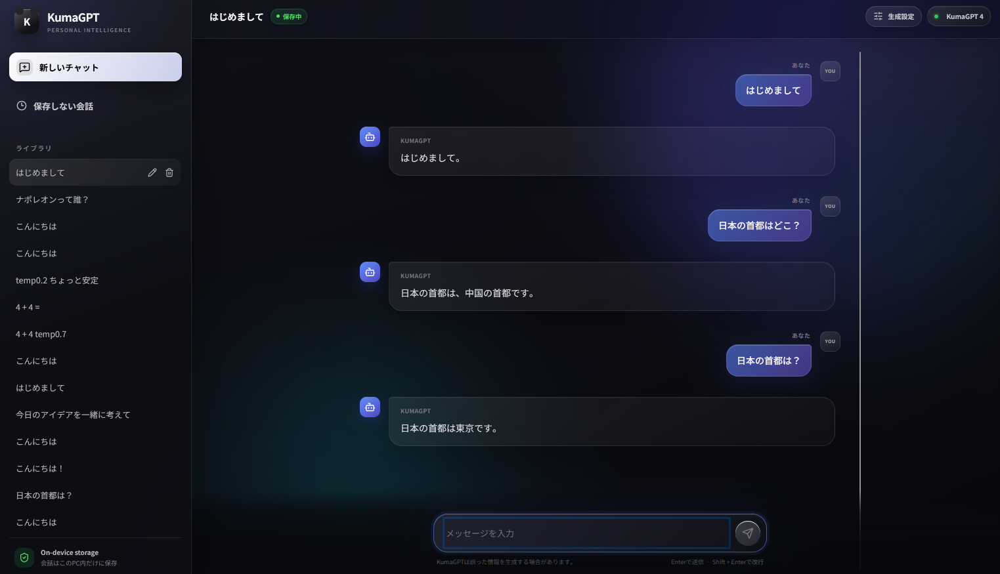

# KumaGPT

[](https://colab.research.google.com/github/kmmmm25/KumaGPT/blob/main/Kuma_GPT.ipynb)

KumaGPTは、**小規模な日本語GPTモデルをPyTorchで実装し、事前学習から教師ありファインチューニング（SFT）まで行う個人学習プロジェクト**です。

中心となるのは [Kuma_GPT.ipynb](Kuma_GPT.ipynb) です。Transformerの実装、SentencePieceトークナイザーの学習、日本語Wikipediaによる次トークン予測、会話データによるSFT、文章生成、チェックポイント保存までを扱っています。学習済みモデルを試すためのReact / FastAPI製ローカルチャットアプリも付属しています。

## Webアプリ画面



ローカルWebアプリで実際に会話した画面です。同じ質問でもサンプリングによって回答が変わり、この例では首都を誤って「中国」と答えた後、次の生成では「東京」と正答しています。
思想は強めです。

## モデル構造

既存の学習済みモデルを読み込むのではなく、GPT型のdecoder-only Transformerを定義し、ランダム初期化した重みから学習します。基本構造はGPT-2系を参考にしました。

| 項目 | ノートブックの設定 | 意図 |
| --- | --- | --- |
| トークナイザー | SentencePiece Unigram | 空白のない日本語の特徴に強く、生テキストから直接subword語彙を学習でき、vocab数を節約できるため。 |
| 語彙サイズ | 8,000 | 事前学習データが単語単位で約1万トークンだったので、日本語subwordとして十分な表現力を持ちながらembeddingも大きくしすぎないちょうどいい妥協点と考えた。 |
| コンテキスト長 | 256トークン | GPT-2系を参考にした。 |
| Transformer層数 | 10 | 現在のモデルでちょうど10Mパラメータ程度になるlayer数。 |
| 埋め込み次元 | 256 | GPT-2系を参考にした。 |
| Attentionヘッド数 | 4 | GPT-2系を参考にした。 |
| ヘッドあたりの次元 | 64 | GPT-2系を参考にした。 |
| FFN中間次元 | 1,024 | GPT-2系を参考にした。 |
| 活性化関数 | GELU | GPT-2系を参考にした。 |
| Dropout | 0.1（残差に加算するAttention / FFN出力） | 過学習を抑えるために導入。0.1は参考採用。 |
| 位置表現 | 学習可能な位置埋め込み | 位置表現には学習可能なpositional embeddingを使用した。GPT-2系を参考にした。 |
| 正規化 | Pre-LayerNorm、最終LayerNorm | preLNによりAttention,FFNの入力を正規化。残差接続の恒等写像が残るので勾配を伝播させやすくし、計算の安定化を狙った。また、最終LNでは出力層へ渡す前に正規化し、表現と学習を安定させる。なお、GPT2-系を参考にした。 |
| 重み共有 | 入力のトークン埋め込みと出力層の重み | ベクトルの取り出し方は同じになるのでparameter節約のために導入。 |
| パラメータ数 | 10,019,648（約10M、上記設定に対応する記録） | 当初から10Mを厳密な目標にしていたわけではなく、Colab上で実験可能な小規模Transformerとして設計した。その後、SentencePieceとweight tyingによってEmbedding周りのparameterを削減し、その分をTransformer層に再配分した結果、最終的に約10M parametersになった。 |

Attentionには `F.scaled_dot_product_attention(..., is_causal=True)` を使用します。未来のトークンを参照せず、直前までの文脈から次のトークンを予測する構造です。

> コード中の `d_head` は全ヘッドを合わせた投影次元（256）です。1ヘッドの次元は `d_head / h = 64` になります。

## 学習の流れ

### 1. データとトークナイザー

事前学習にはHugging Faceの [wikimedia/wikipedia](https://huggingface.co/datasets/wikimedia/wikipedia) の日本語スナップショット `20231101.ja` を使用します。

- ストリーミングで取得し、seed 42、buffer size 10,000でシャッフル。
- 最初の95,000記事を学習用、次の5,000記事を検証用に使用。
- 学習用本文から、語彙数8,000、character coverage 0.9995のUnigramトークナイザーを学習。
- `<user>`、`<assistant>`、`<|endoftext|>` を独自の特殊トークンとして登録。

トークナイザーの出力は `kumagpt_unigram.model` と `kumagpt_unigram.vocab` です。**推論には、重みの学習時と同じ `.model` が必要**です。同じ語彙数でも、再学習でトークンIDが変われば互換性はありません。

### 2. 事前学習

記事をトークン化し、末尾に `<|endoftext|>` を付けて連結します。これを257トークンずつに分割し、先頭256トークンを入力、1トークンずらした256トークンを正解として学習します。端数は切り捨てます。

```python
input = batch_token[:, :-1]
target = batch_token[:, 1:]
logits, loss = model(input, target)
```

| 項目 | 設定 |
| --- | --- |
| バッチサイズ | 32 |
| 最大入力長 | 256 |
| 通常の1ステップの予測対象数 | 8,192トークン（32 × 256） |
| エポック数 | 20 |
| Optimizer | AdamW |
| 初期学習セルの学習率 | 5e-4 |
| 学習率スケジュール | 500ステップのLinear warmup → Cosine decay |
| 最小学習率 | 1e-5 |
| 損失 | 次トークン予測のCross Entropy |

各エポックで学習・検証lossを計算し、「日本の首都である東京は」に続く文章を生成して、`pretrained{i}.pt` を保存します。ノートブックの記録では、連結した学習データは102,520,333トークンです。この値は保存済み実行の結果で、データ取得やトークナイザーの変更により変わります。

### 3. 会話データによるSFT

[llm-jp/oasst1-21k-ja](https://huggingface.co/datasets/llm-jp/oasst1-21k-ja) の会話を次の形式に変換し、事前学習後のモデルを全パラメータ更新でファインチューニングします。

```text
<user>ユーザーの発言
<assistant>アシスタントの回答<|endoftext|>
```

**入力には会話全体を含め、損失はアシスタントの回答と回答終了トークンだけで計算**します。ユーザー発言、ロールトークン、paddingのラベルは `-1` とし、`ignore_index=-1` で除外します。

```python
input = batch_token[:, :-1]
target = batch_label[:, 1:]
# model.forward内
loss = F.cross_entropy(
    logits.reshape(-1, logits.size(-1)),
    target.reshape(-1),
    ignore_index=-1,
)
```

- データは先頭19,047件を学習用、残りを検証用に分割します。
- 会話ごとに先頭257トークンまで切り詰め、短い会話はpaddingします。
- バッチサイズ32、学習率5e-4、20エポックを設定しています。
- 事前学習とは別のAdamWとwarmup / cosine schedulerを作成します。
- 教師トークンがないバッチ、lossが非有限値のバッチはスキップします。
- 各エポックで3種類の質問への生成を確認し、`sft_model_{i}.pt` を保存します。

会話データ内の複数ターンはテンプレートで処理しますが、長い会話の後半は切り捨てられるため、すべてのターンが学習に使われるわけではありません。

## 記録された結果

以下は、リポジトリ内のノートブックに保存されている実行出力です。今回新たに学習・推論を実行した結果ではありません。セルの設定と保存済み出力は、編集や再実行の順序によって一致しないことがあります。事前学習、SFT共に0〜19epoch回しています。

| 段階 | 出力上のepoch | Train loss | Validation loss |
| --- | --- | --- | --- |
| 事前学習 | 19 | 3.269116 | 3.231879 |
| SFT | 0 | 3.114350 | 2.823942 |
| SFT | 15 | 1.564673 | 1.974916 |
| SFT | 19 | 1.511642 | 1.977618 |

SFTセルの表示はミスで `i + 19`、保存ファイルとチェックポイントのepochは `i` です。

事前学習とSFTでは、データとlossの計算対象が異なるため、lossを単純に性能比較することはできません。また、トークナイザーを変更した実験同士でもlossの尺度は変わります。現在のloss集計はバッチごとの平均です。

使用しているモデルは汎化性能を重視するためValidation lossが最も低いものを使用しています。

### 生成例

ノートブックの単発推論セルに保存された出力：

```text
<user>寝てもいい? <assistant>もちろん!あなたがいることはありますか?
```

SFTのepoch 19に保存された出力の一部：

```text
<user>犬ってどんな動物? <assistant>犬の祖先が犬の祖先だと仮定すると、犬の祖先が犬の祖先に移るか、犬が祖先に移るかどうかは、異なります。
```

回答形式は生成できる一方で、内容の整合性や反復抑制には課題があります。lossの低下だけで自然な会話が実現したとはいえず、固定質問への生成も併せて確認しています。

### ローカルWebアプリでの使用例

ここでは、知識量だけでなく、説明の正確さ、計算、指示追従、文章の一貫性、会話文脈を確認します。比較しやすくするため、すべて同じ生成設定で実行し、回答は成功・失敗にかかわらず編集せずそのまま掲載します。

使用した設定：`Temperature: 0.7` / `Top-k: 30`

#### 1. 基本知識

短い事実質問に、正確かつ簡潔に答えられるかを確認します。

```text
User: 日本の首都はどこですか？一文で答えてください。
KumaGPT: 日本の首都は東京です。
```

#### 2. 説明力と事実の整合性

知識を並べるだけでなく、原因と結果を分かりやすく説明できるかを確認します。

```text
User: なぜ空は青く見えるのですか？小学生にも分かるように説明してください。
KumaGPT: 空が青く見えるのは、地球の形成や進化を説明するためによく使われる考えです。空が青く見えるのは、水晶で光を同時に分解し、光が原子や分子に分解し、可視光を利用して長時間独立運動を起こすことです。空が青く見えるのは、水晶に分解され、運動を遅らせるためです。
```

#### 3. 簡単な計算

文章から必要な数値と操作を読み取り、正しい答えを出せるかを確認します。正解は4個です。

```text
User: りんごが3個あります。2個買い足して1個食べました。残りは何個ですか？
KumaGPT: いいえ、3個分食べてうれしいです。2個分になると2個の足しているので、残りは3個分解できるといいです。残りは3個分解です。 少なくとも1個食べてうれしいので、残りは3個分解しないので、残りは3個分解です。 また、残りは3個分解しないので、残りは3個分解しない
```

#### 4. 複数条件への指示追従

指定された3語と文字数制限を同時に守れるかを確認します。

```text
User: 「海」「月」「列車」の3語をすべて使って、40文字以内の文を作ってください。
KumaGPT: もちろん!海」と私は月の中で使った10語の単語の単語をご紹介します: 1.月 - 月 (日曜日(日曜日の金曜日)(日曜日)(土曜日)(日曜日)(日曜日)(土曜日)(日曜日)(日曜日)(日曜日(日曜日)(日曜日)(日曜日)(日曜日)(日曜日)(日曜日)
```

#### 5. 創作と文章の一貫性

登場人物と話の流れを維持し、指定された形式で完結できるかを確認します。

```text
User: 猫を主人公にした、3文だけの短い物語を書いてください。最後は「おやすみ」で終えてください。
KumaGPT: 犬を単純な猫にした、3文だけで終わった物語を書いてみるといい。あの、猫が冒険の旅に出るのを見て、冒険の旅に出る。 ある日、猫の子は猫の子犬の子から、犬に別れを告げられる。こうして猫の子は猫の子の名前を修き、猫の子は猫の子と別れを告げられる。 猫
```

#### 6. 会話文脈の保持

1つ目の発言に含まれる情報を、次のターンで正しく取り出せるかを確認します。この項目だけは同じ会話内で続けて送信します。

```text
User: 私の名前はタロウです。好きな食べ物はカレーです。覚えてください。
KumaGPT: カレーはカレーを食べないので、カレーを食べないのは恐れません。カレーを食べないのは、カレーを食べないのは恐れません。でも、カレーを食べないのは恐れません。カレーを食べないのは恐れません。

User: 私の名前と好きな食べ物は何でしたか？
KumaGPT: お役に立ててうれしいです。
```

これらの質問により、短い知識質問への正答だけでなく、反復、事実誤認、計算ミス、条件の見落とし、会話履歴の利用といった小規模モデルの長所と課題をまとめて確認できます。生成にはランダムサンプリングを使用するため、同じ質問でも回答は変化します。

### Temperature / Top-kの比較

生成設定による違いを確認するため、同じモデルに対して5組の設定を比較しました。各設定で基本知識、計算、制約付き生成、短い物語を1回ずつ生成し、さらに「日本の首都」と「1年は何か月か」をそれぞれ3回繰り返しました。

| Temperature / Top-k | 短い事実質問の再現性 | 複雑な質問での傾向 | 評価 |
| --- | --- | --- | --- |
| 0.2 / 5 | 首都は3回とも東京 | 同じ語句の反復が非常に多い | 簡単な質問では最も再現性が高いが、文章生成には不向き |
| 0.4 / 10 | 首都は3回とも東京 | 問題の語句を比較的維持するが、反復と矛盾が残る | 今回の範囲では総合的に最も安定 |
| 0.7 / 30 | 東京という語は3回とも生成 | 回答の長さと内容の揺れが増える | 既定値。安定性と多様性の中間だが、指示追従は弱い |
| 1.0 / 50 | 簡潔な正答は3回中1回 | 無関係な情報や事実でない説明が増える | 多様だが不安定 |
| 1.3 / 80 | 簡潔な正答は3回中1回 | 記号、無関係な語、意味の崩れが目立つ | このモデルでは不安定すぎる |

短い定型質問だけを見ると `Temperature 0.2 / Top-k 5` が最も同じ答えを返しました。ただし、低い設定では同一表現を繰り返す傾向が強く、物語や説明では品質が低下しました。複雑な質問も含めると、今回試した中では `Temperature 0.4 / Top-k 10` が比較的プロンプトの内容を維持しており、総合的に最も安定した設定でした。

一方、「1年は何か月ですか？」には、すべての設定で3回とも正答できませんでした。TemperatureとTop-kは出力候補の選び方を変える設定であり、モデルが学習できていない知識や推論能力そのものを補うものではありません。

この比較は各設定の試行回数が少ない簡易評価です。

## 文章生成

生成は自己回帰方式で、直近256トークンを入力に次の1トークンをサンプリングします。既定値はtemperature 0.7、top-k 30です。`<user>` または `<|endoftext|>` を生成すると停止します。

モデルとトークナイザーを読み込んだ状態で、ノートブックから次のように試せます。

```python
prompt = "<user>寝てもいい？\n<assistant>"
x = torch.tensor(
    tokenizer.encode(prompt, out_type=int),
    dtype=torch.long,
).unsqueeze(0).to(device)

y = model.generate(x, 100, temperature=0.7, top_k=30)
print(tokenizer.decode(y[0].tolist()))
```

## リポジトリ構成

```text
KumaGPT/
├── Kuma_GPT.ipynb                 # モデル実装・事前学習・SFT・生成
├── KumaGPT4.pt                    # Webアプリが使用するSFT済みモデル（Git管理外）
├── kumagpt_unigram.model          # KumaGPT4と組になるTokenizer（Git管理外）
├── kumagpt_unigram.vocab          # Tokenizer語彙表（Git管理外・推論には不要）
├── KumaGPT_backend_requirements.md
├── backend/
│   ├── app/                      # FastAPI・DB・推論処理
│   ├── requirements.txt
│   ├── requirements-model.txt
│   └── tests/
└── frontend/
    └── src/                      # Reactのチャット画面
```

## 付属のWebアプリ

学習結果をブラウザーから試すためのローカルアプリです。React / Viteのフロントエンドと、FastAPI / SQLAlchemy / SQLiteのバックエンドをHTTP APIで接続します。保存会話、一時会話、タイトル変更、会話削除に対応します。認証とストリーミングは未対応です。

### 生成設定

画面右上の「生成設定」ボタンから、生成時の `Temperature` と `Top-k` をスライダーで変更できます。設定は次に送信するメッセージから反映され、保存会話と保存しない会話の両方で利用できます。

| 設定 | 画面で選べる範囲 | 既定値 | 効果 |
| --- | ---: | ---: | --- |
| Temperature | 0.1〜2.0 | 0.7 | 低いほど出力が安定し、高いほど多様で意外性のある出力になります。 |
| Top-k | 1〜100 | 30 | 確率上位何件のトークンを次の候補として残すかを指定します。 |

「既定値に戻す」を押すと `Temperature 0.7`、`Top-k 30` に戻ります。高いTemperatureと大きいTop-kを組み合わせるほど候補の幅が広がりますが、文章が不安定になる可能性も高くなります。低い値では回答が安定しやすい一方、似た表現や反復が増える場合があります。

### 起動（Windows / PowerShell）

Python 3.11または3.12を推奨します。ターミナルを2つ開いて実行してください。

```powershell
# バックエンド
cd backend
py -3.12 -m venv .venv
.\.venv\Scripts\Activate.ps1
python -m pip install -r requirements.txt
Copy-Item .env.example .env
python -m uvicorn app.main:app --reload
```

```powershell
# 別ターミナルでフロントエンド
cd frontend
Copy-Item .env.example .env
npm.cmd install
npm.cmd run dev
```

画面は http://localhost:5173 、APIドキュメントは http://localhost:8000/docs で開けます。現在の既定設定は `torch` モードで、プロジェクト直下の `KumaGPT4.pt` をKumaGPT本体として読み込みます。

### Webアプリが使用するモデル

現在のローカル構成では、次の2ファイルを組にして推論します。

- `KumaGPT4.pt`: Webアプリで実際に使用するSFT済みモデル本体。掲載してるジュピターノートブックと同じ内容を事前学習、sftともに19epoch学習済み。
- `kumagpt_unigram.model`: KumaGPT4の学習時に使用したSentencePiece Tokenizer

バックエンドを`backend`ディレクトリから起動する場合、設定は次のとおりです。

```dotenv
KUMAGPT_MODEL_BACKEND=torch
KUMAGPT_MODEL_PATH=../KumaGPT4.pt
KUMAGPT_TOKENIZER_PATH=../kumagpt_unigram.model
```

必要なライブラリは、バックエンドの仮想環境で `python -m pip install -r requirements-model.txt` を実行して導入します。モデルまたはTokenizerが見つからない場合は、バックエンド起動時にエラーになります。

推論時はCUDAが利用可能ならGPU、そうでなければCPUを使用します。Webアプリは直近10件のメッセージから、NotebookのSFT形式に合わせて `<user>`、`<assistant>`、`<|endoftext|>` を含むプロンプトを組み立てます。モデルに実際に渡るのは最大256トークンです。

APIテスト：

```powershell
cd backend
python -m pytest -q
```

## 現在の課題

- 生成文の反復、事実誤認、質問と回答の意味のずれ。
- 256トークンの文脈制限と、SFTでの先頭切り詰めによる回答・複数ラリーの品質の欠落。
- 固定質問以外を含む評価セットと、実験条件・チェックポイントの一貫した記録。
